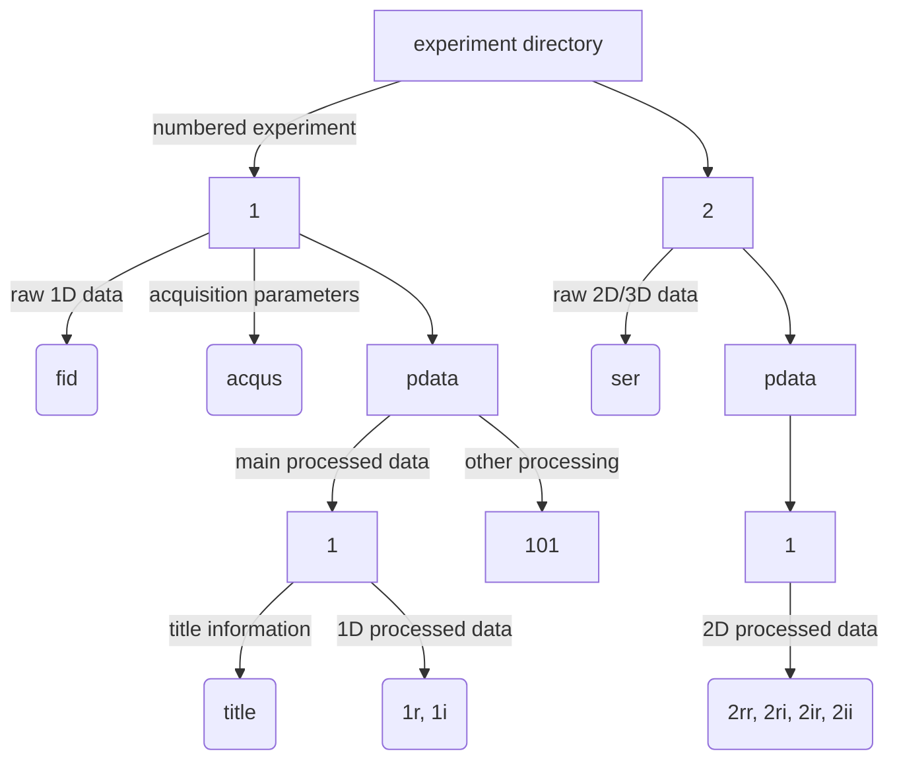

# Topspin Basics
{: .no_toc }

## Table of contents
{: .no_toc .text-delta }

1. TOC
{:toc}

{: .note }
> This is a working draft - do not use!

## Adding Directories to the Data Browser

TODO

## Internal Command Line

The internal Topspin command line can be accessed by pressing the `ESC` key. This allows you to execute Topspin commands.

Some useful commands:

* `re XX` - Open (read) experiment number XX
* `rep XX` - Open (read) processed data number XX
* `re XX YY` - Open (read) processed data YY from experiment XX
* `edp` - Edit processing parameters 
* `eda` - Edit acquisition parameters
* `ase` - Edit pulse program parameters (additional acquisition parameters)
* `zg` - Begin acquisition (any existing data in current experiment will be deleted)
* `stop` - Interrupt current acquisition IMMMEDIATELY
* `a` - Open acquisition window

## Acquired vs Processed Data 

It's important to understand the distinction between raw acquired data, and processed data (pdata):

- **Acquired data** - The direct output of the spectrometer, saved as `fid` or `ser` files. These files should not be modified following acquisition, and cannot be recovered if deleted.
- **Processed data (pdata)** - Spectra that have likely been Fourier transformed and phased. Saved as `1r` or `2rr` files. Processed data can always be reconstructed from the original acquired data, and is frequently overwritten while processing.

## Directory Structure

Topspin uses a standardized directory structure:

- **Experiment directory** - Contains a collection of numbered experiments 
- **Numbered experiments** - Individual measurements are numbered (doesn't have to be sequential)
- **`fid` file** - Raw free induction decay data, before Fourier transform, for a 1D experiment
- **`ser` file** - Raw free induction decay data, before Fourier transform, for 2D/3D experiments
- **`acqus` file** - Contains acquisition parameters, including pulse lengths, number of scans, receiver gain, etc.
- **Processed data (pdata)** - Contains numbered directories storing the processed data. Always contains pdata number `1`, which stores the title file (contents of the title tab from Topspin)
- **`1r/1i` files** - Processed 1D data (real and imaginary components)
- **`2rr,2ri,2ir,2ii` files** - Processed 2D data (real and imaginary components)

## Auxiliary Directories 

- pulse programs...

## Setting Preferences 

Preferences like fonts, colors, auxilliary directories etc. can be set using the `setres` command.

## Reading Experiments 

- `re XX` - Open (read) experiment number XX
- `rep XX` - Open (read) processed dataset number XX from the current experiment
- `re XX YY` - Open (read) processed dataset number YY from experiment XX

## Copying Data

- `edc` - Copy an experiment setup (opens a dialog)
- `wrpa XX` - Copy an experiment, including acquired data, to new experiment number `XX`
- `wrp XX` - Write a copy of the current processed dataset to a new processed dataset number `XX`

## Good Practise for Naming Experiments 

- Include your name and the date alongside a brief indication of the sample/measurement in the main folder title, e.g. `chris_fln5_assignment_240130`
- Always use dates in the `YYMMDD` format - this makes it easy to sort by date at a later stage
- Group related samples (e.g. titration measurements) within a directory by separating experiment numbers by tens or hundreds
- Use high numbers like 999 for quick test experiments
- Provide clear sample details in the title file. This should include sample composition, isotopic labelling, solvent, temperature, buffer, and the experiment being acquired. Put a quick summary in the first line and details in subsequent lines.

## Access Processing and Acquisition Parameters

- `edp` - Edit processing parameters
- `eda` - Edit acquisition parameters 
- `ased` - Additional pulse program parameters
